<div align="center">


# ⚡ pleb-ln
### *Power to the Plebs!*

[](https://flutter.dev)
[](https://dart.dev)
[](https://lightning.network)
[](LICENSE)

*A beautiful, fast, and secure remote control for your LND Lightning Network node*

[📱 Features](#-features) • [🚀 Quick Start](#-quick-start) • [📋 Prerequisites](#-prerequisites) • [🛠️ Development](#️-development) • [🐛 Support](#-support)

</div>

---

## 🌟 Features

<table>
<tr>
<td width="50%">

### ⚡ Lightning Fast
- **Instant payments** via Lightning Network
- **Real-time balance** updates
- **Lightning speed** invoice creation
- **Channel management** at your fingertips

</td>
<td width="50%">

### 🔒 Secure & Private
- **gRPC encryption** for all communications
- **Secure storage** for credentials
- **No data collection** - your privacy first
- **Open source** - verify the code yourself

</td>
</tr>
<tr>
<td width="50%">

### 📱 Cross Platform
- **Android** (5.0+)
- **iOS** (12.0+)
- **Web browsers**
- **Windows, macOS, Linux**

</td>
<td width="50%">

### 🎯 User Friendly
- **Intuitive interface** for Bitcoin plebs
- **QR code scanning** for easy payments
- **Channel policy** management
- **On-chain** and **off-chain** views

</td>
</tr>
</table>

---

<div align="center">

### 📸 Screenshots

<p>


</p>

*Beautiful, intuitive interface designed for Lightning Network enthusiasts*

</div>

---

## 🚀 Quick Start

> **Want to get started immediately?** Follow these simple steps!

<details>
<summary><b>🎯 One-Click Setup (Recommended)</b></summary>

```bash
# 1. Clone the repository
git clone https://github.com/Tyler-McIntyre/Pleb-LN.git
cd "Pleb LN"

# 2. Install dependencies
flutter pub get

# 3. Launch app with one command!
make quick
```

</details>

### ⚠️ Important Security Notice

> **pleb-ln currently requires direct network access to your LND node**
> 
> 🚫 **Tor support is coming soon!** Until then, only use on your secure home network.
> 
> 🏠 Connect using the same host/IP you use for SSH access to your node.

---

## 📋 Prerequisites

<div align="center">

### 🖥️ System Requirements

| Component | Minimum | Recommended |
|-----------|---------|-------------|
| **OS** | Windows 10 / macOS 10.14 / Ubuntu 18.04 | Latest stable |
| **RAM** | 8GB | 16GB+ |
| **Storage** | 10GB free | 20GB+ free |
| **Network** | Stable internet | High-speed connection |

</div>

<details>
<summary><b>🛠️ Development Tools Required</b></summary>

### Core Development Stack

| Tool | Version | Purpose |
|------|---------|---------|
| **Flutter SDK** | 3.24.0+ | App framework |
| **Dart SDK** | 3.5.0+ | Programming language |
| **Git** | Latest | Version control |
| **Make** | Any | Build automation |

### Platform-Specific Tools

<table>
<tr>
<th>🤖 Android Development</th>
<th>🍎 iOS Development</th>
</tr>
<tr>
<td>

- **Android Studio** (Latest)
- **Android SDK** (API 31+)
- **Java JDK** (OpenJDK 17)
- **Android Emulator**

</td>
<td>

- **Xcode** (15.0+) *macOS only*
- **iOS SDK** (12.0+)
- **CocoaPods** (Latest)
- **iOS Simulator**

</td>
</tr>
</table>

### Lightning Network Requirements

| Component | Version | Notes |
|-----------|---------|-------|
| **LND Node** | 0.17.0+ | Your Lightning node |
| **gRPC** | Auto-included | Communication protocol |
| **Macaroon** | From your node | Authentication |
| **TLS Certificate** | From your node | Secure connection |

</details>

---

## 🚀 Installation

### Method 1: Quick Setup (Recommended)

```bash
# 📥 Clone repository
git clone https://github.com/Tyler-McIntyre/Pleb-LN.git
cd "Pleb LN"

# 📦 Install dependencies  
flutter pub get

# 🏥 Health check
flutter doctor

# 🚀 Launch development environment
make quick
```

### Method 2: Step-by-Step Setup

<details>
<summary><b>📖 Detailed Installation Guide</b></summary>

#### Step 1: Environment Setup
```bash
# Verify Flutter installation
flutter doctor -v

# Accept Android licenses (if needed)
flutter doctor --android-licenses
```

#### Step 2: Project Dependencies
```bash
# Install Flutter packages
flutter pub get

# For iOS development (macOS only)
cd ios && pod install && cd ..
```

#### Step 3: Development Environment
```bash
# Create Android emulator (optional)
flutter emulators --create --name pleb_emulator

# List available devices
flutter devices
```

</details>

---

## 🔧 Development

<div align="center">

### 🚀 Make Commands (Recommended)

*Streamlined development workflow with our custom Makefile*

</div>

| Command | Description | Use Case |
|---------|-------------|----------|
| `make help` | 📋 Show all commands | Getting started |
| `make quick` | 🚀 Launch emulator + run app | **Daily development** |
| `make run` | ⚡ Run with hot reload | Code changes |
| `make build` | 🔨 Build debug APK | Testing builds |
| `make devices` | 📱 List connected devices | Device management |
| `make clean` | 🧹 Clean build artifacts | Troubleshooting |

<details>
<summary><b>🔧 Manual Flutter Commands</b></summary>

```bash
# Development
flutter run                    # Run with hot reload
flutter run --release         # Run in release mode
flutter run -d <device-id>     # Run on specific device

# Building
flutter build apk --debug      # Debug APK
flutter build apk --release    # Release APK  
flutter build ios --release    # iOS release build

# Testing & Quality
flutter test                   # Run unit tests
flutter analyze               # Code analysis
dart format .                 # Format code
```

</details>

---

## 🔄 Development Workflow

<div align="center">

### 💡 Recommended Daily Workflow

```mermaid
graph LR
    A[💻 Start Dev] --> B[🚀 make quick]
    B --> C[📝 Code Changes]
    C --> D[🔄 Hot Reload 'r']
    D --> E{🤔 Working?}
    E -->|Yes| F[✅ Commit]
    E -->|No| C
    F --> G[🚀 Deploy]
```

</div>



<details>
<summary><b>📋 Step-by-Step Development Process</b></summary>

### 1. 🌅 Start Your Development Session
```bash
make quick  # Launches emulator and starts app
```

### 2. 💻 Make Your Changes
- Edit code in your favorite IDE
- Save files (auto-triggers hot reload in most IDEs)

### 3. 🔄 Test Changes Instantly  
- Press `r` in terminal for hot reload
- Press `R` for hot restart (if needed)
- Press `q` to quit

### 4. 🧪 Test on Multiple Devices
```bash
make devices           # See available devices
flutter run -d <id>    # Run on specific device
```

### 5. ✅ Code Quality Check
```bash
dart format .          # Format code
flutter analyze        # Check for issues
dart fix --apply       # Auto-fix lint issues
```

</details>

---

## 🧪 Testing

<div align="center">

### 🎯 Testing Strategy

</div>

<table>
<tr>
<th>🧪 Unit Tests</th>
<th>🔗 Integration Tests</th>
<th>⚡ Lightning Tests</th>
</tr>
<tr>
<td>

```bash
# Run all unit tests
flutter test

# Test specific file
flutter test test/models/
```

</td>
<td>

```bash
# Integration testing
flutter test integration_test/

# UI testing
flutter drive --target=test_driver/app.dart
```

</td>
<td>

**Use Lightning Polar**
- [Download Polar](https://lightningpolar.com/)
- Create test Lightning network
- Connect pleb-ln to test nodes

</td>
</tr>
</table>

---

## 📱 Platform Support

<div align="center">

### ✅ Supported Platforms

</div>

| Platform | Version | Status | Notes |
|----------|---------|--------|-------|
| 🤖 **Android** | 5.0+ (API 21+) | ✅ Full Support | Primary platform |
| 🍎 **iOS** | 12.0+ | ✅ Full Support | iPhone & iPad |
| 🌐 **Web** | Modern browsers | ✅ Full Support | Chrome, Firefox, Safari, Edge |
| 🪟 **Windows** | 10+ | ✅ Full Support | Desktop application |
| 🍎 **macOS** | 10.14+ | ✅ Full Support | Desktop application |
| 🐧 **Linux** | Ubuntu 18.04+ | ✅ Full Support | Desktop application |

---

## 🔗 Lightning Network Connection

<div align="center">

### ⚡ Connect to Your LND Node

</div>

<details>
<summary><b>🔧 Connection Setup Guide</b></summary>

### Prerequisites
- ✅ LND node running (version 0.17.0+)
- ✅ Network access to your node
- ✅ Admin macaroon file
- ✅ TLS certificate file

### Setup Steps

1. **🔍 Locate Your Node Files**
   ```bash
   # Typical LND directory locations:
   # Linux: ~/.lnd/
   # macOS: ~/Library/Application Support/Lnd/
   # Windows: %LOCALAPPDATA%\Lnd\
   ```

2. **📋 Copy Required Files**
   - `admin.macaroon` - Authentication
   - `tls.cert` - Secure connection

3. **🔗 Configure Connection**
   - Host: Your node's IP/hostname  
   - Port: Usually 10009 (gRPC)
   - Import macaroon and certificate in app

4. **✅ Test Connection**
   - App will verify connection
   - Check node info and balance

</details>

---

## 🐛 Troubleshooting

<div align="center">

### 🔧 Common Issues & Solutions

</div>

<details>
<summary><b>🚨 Build Issues</b></summary>

```bash
# 🧹 Clean and reset
make clean
flutter pub get
make build

# 🔄 Reset pub cache  
flutter pub cache repair

# 📱 Android license issues
flutter doctor --android-licenses
```

</details>

<details>
<summary><b>📱 Emulator Issues</b></summary>

```bash
# 📋 List available emulators
flutter emulators

# 🆕 Create new emulator
flutter emulators --create --name pleb_dev

# 🚀 Launch specific emulator
flutter emulators --launch pleb_dev
```

</details>

<details>
<summary><b>⚡ Lightning Connection Issues</b></summary>

- ✅ **Check network connectivity** to your node
- ✅ **Verify LND is running** and accessible
- ✅ **Confirm port 10009** is open (default gRPC port)
- ✅ **Check macaroon and TLS cert** are valid
- ✅ **Ensure same network** (no Tor yet)

</details>

---

## 📦 Project Architecture

<div align="center">

### 🏗️ Clean Architecture Overview

</div>

```
pleb-ln/
├── 📱 android/              # Android-specific code
├── 🍎 ios/                 # iOS-specific code  
├── 🎨 lib/                 # Main Dart source code
│   ├── 🖼️  UI/             # User interface screens
│   ├── ⚙️  constants/      # App constants & config
│   ├── 🔧 core/           # Core functionality
│   ├── 📊 models/         # Data models & entities
│   ├── 🔄 provider/       # State management (Riverpod)
│   ├── 🌐 rest/           # REST API communications
│   ├── ⚡ rpc/            # gRPC Lightning Network calls
│   ├── 🛠️  services/       # Business logic services
│   └── 🔨 util/           # Utility functions
├── 🌐 web/                # Web platform code
├── 🪟 windows/            # Windows platform code
├── 🧪 test/               # Unit & integration tests
├── 🖼️  images/             # App assets & screenshots
├── 📡 protos/             # Protocol buffer definitions
├── 📄 pubspec.yaml        # Dependencies & metadata
├── ⚡ Makefile            # Build automation
└── 📖 README.md           # This documentation
```

### 🔧 Key Dependencies

<table>
<tr>
<th>⚡ Lightning Network</th>
<th>🎨 UI Framework</th>
<th>🔒 Security</th>
</tr>
<tr>
<td>

- `grpc` - LND communication
- `protobuf` - Protocol buffers
- `mobile_scanner` - QR scanning

</td>
<td>

- `flutter` - Framework
- `riverpod` - State management  
- `go_router` - Navigation

</td>
<td>

- `flutter_secure_storage` - Credentials
- `crypto` - Cryptographic functions
- `dio` - Secure HTTP client

</td>
</tr>
</table>

---

## 🛣️ Roadmap

<div align="center">

### 🚀 Upcoming Features

</div>

| Feature | Status | Priority | Description |
|---------|--------|----------|-------------|
| 🧅 **Tor Support** | 🔄 In Progress | 🔥 High | Connect through Tor network |
| 🔐 **Biometric Auth** | 📋 Planned | 🔥 High | Face ID / Fingerprint unlock |
| ⚡ **Keysend** | 📋 Planned | 🔥 High | Send payments without invoice |
| 🔗 **On-chain Transactions** | 📋 Planned | 🟡 Medium | Bitcoin base layer support |
| 🔗 **Deep Links** | 📋 Planned | 🟡 Medium | lightning: URL support |
| 🎁 **LNURL Withdraw** | 📋 Planned | 🟡 Medium | Withdraw from LNURL services |

---

## 🤝 Contributing

<div align="center">

### 💜 Help Build the Future of Lightning

*pleb-ln is open source and welcomes contributions from the Bitcoin community*

</div>

- 🐛 **Report bugs** via GitHub Issues
- 💡 **Suggest features** for the roadmap  
- 🔧 **Submit pull requests** with improvements
- 📖 **Improve documentation** 
- ⭐ **Star the repo** if you find it useful!

---

<div align="center">

### 🙏 Acknowledgments

*A huge thank you to all the Bitcoin and Lightning Network developers who make this possible*

**Special thanks to:**
- ⚡ [Lightning Labs](https://lightning.engineering/) for LND
- 🛠️ [Flutter Team](https://flutter.dev/) for the amazing framework
- 🔧 [Polar](https://lightningpolar.com/) for Lightning development tools
- 🧡 The entire **Bitcoin community** for inspiration and support

---

<p>
<a href="https://lightning.network">

</a>
</p>

**Made with 🧡 for the Bitcoin community**

</div>

## 📋 Prerequisites

### System Requirements
- **Operating System**: Windows, macOS, or Linux
- **RAM**: Minimum 8GB (16GB recommended for development)
- **Storage**: At least 10GB free space
- **Network**: Stable internet connection for dependencies and LND node communication

### Required Dependencies

#### 1. Flutter SDK
- **Version**: 3.24.0 or higher
- **Installation**: 
  - Visit [Flutter Install Guide](https://docs.flutter.dev/get-started/install)
  - Follow platform-specific instructions
  - Verify installation: `flutter doctor`

#### 2. Dart SDK
- **Version**: 3.5.0 or higher (included with Flutter)
- **Verification**: `dart --version`

#### 3. Android Development (for Android builds)
- **Android Studio**: Latest stable version
- **Android SDK**: API level 31 or higher
- **Android SDK Command-line Tools**: Latest version
- **Java Development Kit (JDK)**: OpenJDK 17 or Oracle JDK 17
- **Android Emulator**: For testing (Pixel 4 API 31 recommended)

#### 4. iOS Development (for iOS builds - macOS only)
- **Xcode**: Latest stable version (15.0+)
- **iOS SDK**: iOS 12.0 or higher
- **CocoaPods**: Latest version (`sudo gem install cocoapods`)
- **iOS Simulator**: For testing

#### 5. Development Tools
- **Git**: For version control
- **VS Code** or **Android Studio**: Recommended IDEs
- **Make**: For build automation (included with Git Bash on Windows)

#### 6. Lightning Network Dependencies
- **LND Node**: Version 0.17.0 or higher
- **gRPC**: Supported through Flutter packages
- **Protocol Buffers**: For LND API communication

## 🚀 Installation

### 1. Clone the Repository
```bash
git clone https://github.com/Tyler-McIntyre/Pleb-LN.git
cd "Pleb LN"  # Note: Repository has spaces in name
```

### 2. Install Flutter Dependencies
```bash
flutter pub get
```

### 3. Verify Flutter Installation
```bash
flutter doctor
```
Ensure all checkmarks are green. Install missing dependencies as prompted.

### 4. Configure Development Environment

#### For Android Development:
1. Accept Android licenses:
   ```bash
   flutter doctor --android-licenses
   ```
2. Create Android emulator (if needed):
   ```bash
   flutter emulators --create --name flutter_emulator
   ```

#### For iOS Development (macOS only):
1. Install iOS dependencies:
   ```bash
   cd ios && pod install && cd ..
   ```
2. Open iOS Simulator or connect physical device

## 🔧 Development Setup

### Quick Start with Make Commands

This project includes a Makefile for streamlined development:

```bash
# See all available commands
make help

# Launch emulator and run app (one command!)
make quick

# Just run the app with hot reload
make run

# Build debug APK
make build

# Check connected devices
make devices

# Clean build artifacts
make clean
```

### Manual Flutter Commands

If you prefer using Flutter commands directly:

```bash
# List available devices/emulators
flutter devices

# Launch emulator
flutter emulators --launch Pixel_4_API_31

# Run app in debug mode
flutter run

# Build debug APK
flutter build apk --debug

# Build release APK
flutter build apk --release

# Install on connected device
flutter install
```

## 🛠️ Building the Project

### Debug Build
```bash
# Using Make
make build

# Using Flutter
flutter build apk --debug
```

### Release Build
```bash
# Using Flutter
flutter build apk --release
```

The built APK will be located in `build/app/outputs/flutter-apk/`

## 🧪 Testing

### Unit Tests
```bash
flutter test
```

### Integration Testing
1. Ensure device/emulator is connected
2. Run integration tests:
   ```bash
   flutter test integration_test/
   ```

## Testing with polar
Download Polar for testing locally
https://lightningpolar.com/

As of now, pleb-ln only supports LND.

## 🔄 Development Workflow

### Daily Development
1. **Start development session**:
   ```bash
   make quick
   ```
   
2. **Make code changes**
   
3. **Hot reload**: Press `r` in terminal or `Ctrl+S` in IDE

4. **Hot restart**: Press `R` in terminal if needed

5. **Test on different devices**:
   ```bash
   make devices  # List available devices
   flutter run -d <device-id>
   ```

### Code Quality
```bash
# Format code
dart format .

# Analyze code
flutter analyze

# Fix linting issues
dart fix --apply
```

## 📱 Supported Platforms

- ✅ **Android**: API level 21+ (Android 5.0+)
- ✅ **iOS**: iOS 12.0+
- ✅ **Web**: Chrome, Firefox, Safari, Edge
- ✅ **Windows**: Windows 10+
- ✅ **macOS**: macOS 10.14+
- ✅ **Linux**: Ubuntu 18.04+

## 🔗 LND Node Connection

### Requirements
- **LND Version**: 0.17.0 or higher
- **Network Access**: Direct connection to LND node (Tor not yet supported)
- **Authentication**: Valid macaroon and TLS certificate

### Connection Setup
1. Ensure LND node is running and accessible
2. Configure connection settings in the app
3. Import macaroon and TLS certificate
4. Test connection

## 🐛 Troubleshooting

### Common Issues

#### Flutter Doctor Issues
```bash
# Fix common Android issues
flutter doctor --android-licenses

# Clear Flutter cache
flutter clean
flutter pub get
```

#### Build Failures
```bash
# Clean and rebuild
make clean
flutter pub get
make build
```

#### Emulator Issues
```bash
# List available emulators
flutter emulators

# Create new emulator if needed
flutter emulators --create
```

#### Package Issues
```bash
# Update dependencies
flutter pub upgrade

# Reset pub cache
flutter pub cache repair
```

### Performance Tips
- Use debug mode for development
- Use profile mode for performance testing
- Use release mode for production builds
- Enable R8 optimization for Android release builds

## 📦 Dependencies Overview

### Core Dependencies
- **flutter**: Framework
- **mobile_scanner**: QR code scanning (replaces flutter_barcode_scanner)
- **grpc**: Lightning Network communication
- **protobuf**: Protocol buffer support
- **riverpod**: State management
- **flutter_secure_storage**: Secure credential storage

### UI Dependencies
- **cupertino_icons**: iOS-style icons
- **google_fonts**: Custom fonts
- **lottie**: Animations
- **qr_flutter**: QR code generation

### Utility Dependencies
- **http**: HTTP requests
- **dio**: Advanced HTTP client
- **intl**: Internationalization
- **crypto**: Cryptographic functions

## 📄 Project Structure

```
pleb-ln/
├── android/          # Android-specific code
├── ios/             # iOS-specific code
├── lib/             # Dart source code
│   ├── UI/          # User interface screens
│   ├── constants/   # App constants
│   ├── core/        # Core functionality
│   ├── models/      # Data models
│   ├── provider/    # State management
│   ├── rest/        # REST API calls
│   ├── rpc/         # gRPC communication
│   ├── services/    # Business logic
│   └── util/        # Utility functions
├── web/             # Web platform code
├── windows/         # Windows platform code
├── test/            # Unit tests
├── images/          # App images and assets
├── protos/          # Protocol buffer definitions
├── pubspec.yaml     # Dependencies and metadata
├── Makefile         # Build automation
└── README.md        # This file
```

### Road map
 - Connecting through Tor
 - Optional pins (Android & IOS) and Face ID (IOS)
 - Keysends
 - On-chain transactions
 - Deep links
 - LNURL withdraw request


